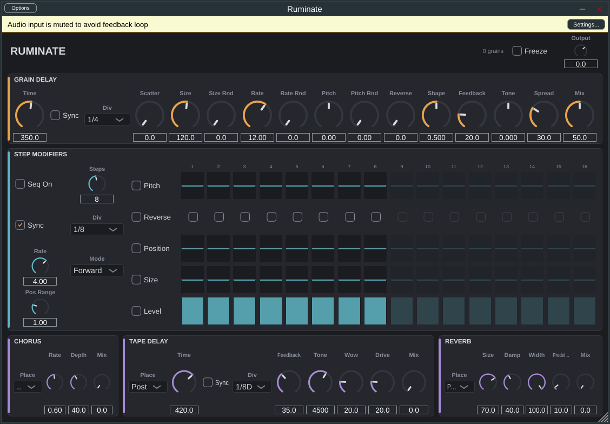

# Ruminate — grain delay with step modifiers

A buffer-based granular delay in the spirit of the Chase Bliss Habit, built with
JUCE. One long memory (60 s), a grain engine that can go from a clean delay to
an ambient cloud, a 16-step modifier sequencer that steps pitch / direction /
position / size / level per grain, and three effects (chorus, tape delay,
reverb) that can each sit before or after the granulator.



## Signal flow

```
in ─► [Chorus?] ─► [Tape?] ─► [Reverb?] ─► GRAIN DELAY ─► [Chorus?] ─► [Tape?] ─► [Reverb?] ─► Output
             (each effect has a Pre / Post switch)
```

Inside the grain delay:

```
                 ┌──────────────── 60 s circular memory ────────────────┐
in + feedback ──►│ write head                                            │
                 └───────────────────────▲─────────────────────────────▲─┘
                                         │ grains read "Time" behind    │
                                         │ the write head (± Scatter),  │
                                         │ forward or reverse, at Pitch │
                                         ▼                              │
                                   window (Shape) ──► sum ──► Tone ──► soft clip ──► × Feedback
                                                       │
                                                       └──► × Mix ──► out
```

Every grain takes a snapshot of the sequencer's current step when it is born,
so stepping pitch or direction is click-free by construction: nothing changes
mid-grain, the next grain simply uses the new values.

## Controls

### Grain delay
| Control | What it does |
|---|---|
| Time / Sync / Div | How far behind the write head grains start. 1 ms – 60 s, or a note division of host tempo. |
| Scatter | Random offset of each grain's start position, as a % of Time. Small = thickening, large = clouds. |
| Size / Size Rnd | Grain length 5 ms – 2 s, plus up to ±1 octave of random variation. |
| Rate / Rate Rnd | Grains per second (0.2 – 100) and timing jitter. Rate × Size = overlap. |
| Pitch / Pitch Rnd | Grain playback pitch in semitones (±24) plus random spread. |
| Reverse | Probability (0–100 %) that a grain plays backwards. |
| Shape | Grain window: 0 = percussive (fast in, slow out), 0.5 = symmetric, 1 = swell. |
| Feedback | Wet signal written back into memory (soft-clipped, so 100 % sustains without blowing up). |
| Tone | Left = darker (lowpass), right = thinner (highpass). Sits in the feedback loop too, so repeats degrade. |
| Spread | Random stereo placement per grain. |
| Mix | Dry/wet for the granulator. |
| Freeze | Stops writing into memory. Grains keep reading whatever is there. |

### Step modifiers
A sequencer that advances on a clock (host-synced note division, or free Hz)
in Forward / Reverse / Ping-Pong / Random order over 1–16 steps. Each lane has
its own on/off; when a lane is off the knob value is used instead.

| Lane | Per-step value |
|---|---|
| Pitch | Semitone offset added to the Pitch knob (±24, integer). |
| Reverse | Play this step's grains backwards. |
| Position | −1…+1, scaled by Pos Range (octaves). +1 with range 1 = double the delay time, −1 = half. |
| Size | −1…+1 → ¼× … 4× grain size. |
| Level | Grain amplitude for the step. 0 = rest, which makes rhythmic gates. |

### Effects
Each has a **Place** switch: **Pre** (feeds the granulator; grains sample the
effected signal, and the effect gets fed back through memory) or **Post**
(effect on the granulator's output).

* **Chorus** – rate, depth, mix. Two modulated lines in quadrature.
* **Tape delay** – time (ms or synced), feedback, tone, wow/flutter, drive, mix.
  Time changes glide instead of clicking; the loop has lowpass, highpass and
  soft saturation so it self-oscillates politely.
* **Reverb** – size, damping, width, pre-delay, mix.

## Getting a build without compiling

Every push builds macOS (universal VST3 / AU / Standalone), Windows (VST3 /
Standalone) and Linux (VST3) automatically. Open the repo's **Actions** tab,
click the latest green run, and download the artifact for your platform.
Install steps, including the one-time macOS quarantine fix, are in
[docs/INSTALL.md](docs/INSTALL.md).

## Building from source

Requires CMake ≥ 3.22 and a C++17 compiler. JUCE 8.0.9 is fetched
automatically, or point at a local checkout with `-DJUCE_DIR=/path/to/JUCE`.

```sh
cmake -S . -B build -DCMAKE_BUILD_TYPE=Release
cmake --build build --parallel
```

Outputs land in `build/Ruminate_artefacts/Release/`: VST3, Standalone and (on
macOS) AU.

Linux build dependencies (Debian/Ubuntu):
`libasound2-dev libx11-dev libxrandr-dev libxinerama-dev libxcursor-dev libxext-dev libfreetype-dev libfontconfig1-dev libgl1-mesa-dev libcurl4-openssl-dev`

### Tests
An offline harness drives the real processor without an audio device:

```sh
./build/RuminateTests            # checks only
./build/RuminateTests renders/   # also writes demo WAVs to listen to
```

It checks dry transparency, grain timing, finite/bounded output at 100 %
feedback (grain and tape), octave-up pitch accuracy, the level lane gating,
pre/post routing, and state save/restore.

## Layout
```
Source/
  PluginProcessor.*     chain, transport, parameter caching
  PluginEditor.*        UI layout
  Parameters.*          parameter IDs and ranges, sync divisions
  dsp/GrainEngine.*     memory + grain scheduler + renderer
  dsp/StepSequencer.h   clock, lanes, per-grain snapshot
  dsp/Chorus.h  dsp/TapeDelay.h  dsp/ReverbFx.h
  dsp/DspUtils.h        circular buffer, interpolation, filters, PRNG
  ui/Controls.h         look & feel, knob / choice / toggle / section widgets
  ui/StepGrid.h         5 × 16 step grid
Tests/RuminateTests.cpp
docs/DESIGN.md          design notes and known characteristics
```
